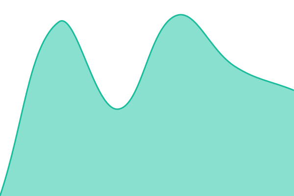

# [📈 Estado agora](https://ryanoliveiragit.github.io/rawly-status): <!--live status--> **Todos os serviços no ar**

This repository contains the open-source uptime monitor and status page for [ryandev](https://ryanoliveiragit.github.io/rawly-status), powered by [Upptime](https://github.com/upptime/upptime).

With [Upptime](https://upptime.js.org), you can get your own unlimited and free uptime monitor and status page, powered entirely by a GitHub repository. We use [Issues](https://github.com/ryanoliveiragit/rawly-status/issues) as incident reports, [Actions](https://github.com/ryanoliveiragit/rawly-status/actions) as uptime monitors, and [Pages](https://ryanoliveiragit.github.io/rawly-status) for the status page.

## [📈 Live Status](https://demo.upptime.js.org): <!--live status--> **Todos os serviços no ar**

<!--start: status pages-->
<!-- This summary is generated by Upptime (https://github.com/upptime/upptime) -->
<!-- Do not edit this manually, your changes will be overwritten -->
<!-- prettier-ignore -->
| URL | Status | History | Response Time | Uptime |
| --- | ------ | ------- | ------------- | ------ |
|  [Aplicativo](https://www.rawlyapp.com.br/api/status/app) | No ar | [aplicativo.yml](https://github.com/ryanoliveiragit/rawly-status/commits/HEAD/history/aplicativo.yml) | 

 637ms
     
 | 

<a href="https://ryanoliveiragit.github.io/rawly-status/history/aplicativo">100.00%</a>
    

|  [Banco de dados](https://www.rawlyapp.com.br/api/status/banco) | No ar | [banco-de-dados.yml](https://github.com/ryanoliveiragit/rawly-status/commits/HEAD/history/banco-de-dados.yml) | 

 728ms
     
 | 

<a href="https://ryanoliveiragit.github.io/rawly-status/history/banco-de-dados">100.00%</a>
    

|  [Entrar na conta](https://www.rawlyapp.com.br/api/status/login) | No ar | [entrar-na-conta.yml](https://github.com/ryanoliveiragit/rawly-status/commits/HEAD/history/entrar-na-conta.yml) | 

 541ms
     
 | 

<a href="https://ryanoliveiragit.github.io/rawly-status/history/entrar-na-conta">100.00%</a>
    

|  [Mensagens em tempo real](https://www.rawlyapp.com.br/api/status/tempo-real) | No ar | [mensagens-em-tempo-real.yml](https://github.com/ryanoliveiragit/rawly-status/commits/HEAD/history/mensagens-em-tempo-real.yml) | 

 429ms
     
 | 

<a href="https://ryanoliveiragit.github.io/rawly-status/history/mensagens-em-tempo-real">100.00%</a>
    

|  [Chamadas de voz e tela](https://www.rawlyapp.com.br/api/status/chamada) | No ar | [chamadas-de-voz-e-tela.yml](https://github.com/ryanoliveiragit/rawly-status/commits/HEAD/history/chamadas-de-voz-e-tela.yml) | 

 569ms
     
 | 

<a href="https://ryanoliveiragit.github.io/rawly-status/history/chamadas-de-voz-e-tela">100.00%</a>
    

|  [Materiais e anexos](https://www.rawlyapp.com.br/api/status/arquivos) | No ar | [materiais-e-anexos.yml](https://github.com/ryanoliveiragit/rawly-status/commits/HEAD/history/materiais-e-anexos.yml) | 

 699ms
     
 | 

<a href="https://ryanoliveiragit.github.io/rawly-status/history/materiais-e-anexos">100.00%</a>
    

|  [Assinatura e pagamento](https://www.rawlyapp.com.br/api/status/pagamento) | No ar | [assinatura-e-pagamento.yml](https://github.com/ryanoliveiragit/rawly-status/commits/HEAD/history/assinatura-e-pagamento.yml) | 

 605ms
     
 | 

<a href="https://ryanoliveiragit.github.io/rawly-status/history/assinatura-e-pagamento">100.00%</a>
    

|  [Resumos e transcrição por IA](https://www.rawlyapp.com.br/api/status/ia) | No ar | [resumos-e-transcricao-por-ia.yml](https://github.com/ryanoliveiragit/rawly-status/commits/HEAD/history/resumos-e-transcricao-por-ia.yml) | 

 592ms
     
 | 

<a href="https://ryanoliveiragit.github.io/rawly-status/history/resumos-e-transcricao-por-ia">100.00%</a>
    

|  [Site público](https://www.rawlyapp.com.br/planos) | No ar | [site-publico.yml](https://github.com/ryanoliveiragit/rawly-status/commits/HEAD/history/site-publico.yml) | 

 1019ms
     
 | 

<a href="https://ryanoliveiragit.github.io/rawly-status/history/site-publico">100.00%</a>
    

|  [Painel de gestão](https://rawly-gestao.vercel.app/login) | No ar | [painel-de-gestao.yml](https://github.com/ryanoliveiragit/rawly-status/commits/HEAD/history/painel-de-gestao.yml) | 

 754ms
     
 | 

<a href="https://ryanoliveiragit.github.io/rawly-status/history/painel-de-gestao">100.00%</a>
    

<!--end: status pages-->

[**Visit our status website →**](https://ryanoliveiragit.github.io/rawly-status)

## 📄 License

- Powered by: [Upptime](https://github.com/upptime/upptime)
- Code: [MIT](./LICENSE) © [Anand Chowdhary](https://anandchowdhary.com)
- Data in the `./history` directory: [Open Database License](https://opendatacommons.org/licenses/odbl/1-0/)
